# Minimap2 Architecture Guide

This guide explains the internal architecture of minimap2's mapping pipeline, covering batch management, worker threads, pipeline coordination, and memory management.

## Overview

Minimap2 uses a **three-stage pipeline architecture** with dynamic worker thread coordination:
- **Stage 0 (Read)**: Read sequences from input files into batches
- **Stage 1 (Map)**: Map reads through seeding → chaining → alignment
- **Stage 2 (Output)**: Write results and cleanup

Worker threads cycle through all stages dynamically, enabling I/O parallelism where reading, mapping, and output happen simultaneously on different batches.

**Terminology:**
- **Pipeline Step (0–2)**: Stages in `kt_pipeline` — **0** Read, **1** Map, **2** Output
- **Mapping Stage (1–3)**: Per-read stages inside `worker_for` — **1** Seed, **2** Chain, **3** Align

## Table of Contents
- [Architecture Concepts](#architecture-concepts)
  - [Batch Management](#batch-management)
  - [Worker Thread Lifecycle](#worker-thread-lifecycle)
  - [Pipeline Stages](#pipeline-stages)
  - [Memory Management](#memory-management-three-level-hierarchy)
  - [Split Index Mapping](#index-parts--split-mapping)
  - [Execution Timeline](#execution-flow-timeline)
  - [Configuration Options](#configuration-options)
- [Data Structures](#data-structures)
- [Pipeline Diagrams](#pipeline-diagrams)
- [Code References](#code-references--key-events)
- [Function Descriptions](#function-descriptions)
- [Logging Architecture](#logging-architecture)

---

## Architecture Concepts

### Batch Management

minimap2 uses **two different batch concepts** that operate at different levels:

| Concept | Option | Default | Used For | Scope |
|---------|--------|---------|----------|-------|
| **batch_size** | `-I` | ~4GB | Index construction | Global setting, applies to index building |
| **mini_batch_size** | `-K` | ~500MB | Mapping pipeline | Per-batch size in streaming mapping pipeline |

**Batch Lifecycle in Pipeline:**

1. **Stage 0 (Read)**: `init_step()` reads up to `mini_batch_size` bases from input file(s)
   - File pointer advances implicitly as reads are consumed by `mm_bseq_read3()` or `mm_bseq_read_frag2()`
   - Creates one `step_t` batch representing one "chunk" of reads
   - Allocates per-thread buffers (`mm_tbuf_t` and `mm_trbuf_t`) for processing
   - Example: If file has 1 billion bases and mini_batch_size=500M, creates 2 batches

2. **Stage 1 (Map)**: All threads process this batch in parallel via `kt_for(n_threads, worker_for, ...)`
   - Each thread calls `worker_for()` for assigned reads
   - Performs seeding → chaining → alignment per read
   - Can process multiple batches simultaneously if pipeline is full

3. **Stage 2 (Output)**: Results written, batch freed
   - Consolidates timing statistics
   - Writes to output file or splits for merge
   - Calls `free_step()` to deallocate all batch resources

**Key Insight:** The pipeline is **I/O-parallel**: Stage 0 can read next batch while Stage 1 maps current batch and Stage 2 outputs previous batch. This overlapping maximizes CPU and I/O utilization.

### Worker Thread Lifecycle

All worker threads follow the **same cycle through all stages**:

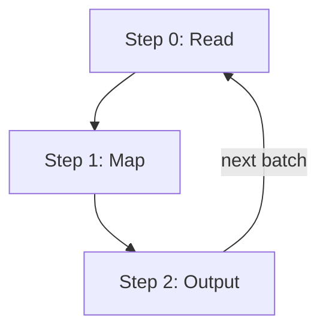


**Key Characteristics:**
- **Dynamic stage assignment**: Workers are NOT statically assigned to stages
- All workers start at step 0, then cycle through 0→1→2→0 repeatedly
- Only **one worker** can be at each step for each batch (enforced by `ktp_t.workers[]` state tracking)
- Synchronization via **mutex + condition variable** ensures proper batch ordering

**Coordination Mechanism:**

The synchronization happens in `ktp_worker()` function:

1. **Lock acquisition**: Worker locks `pthread_mutex_lock(&p->mutex)`
2. **Permission check**: Loops through all workers checking:
   ```c
   if (p->workers[i].step <= w->step && p->workers[i].index < w->index) break;
   ```
   - Cannot proceed to next step until previous worker finished this step
   - Index tracking ensures batches processed in correct order
3. **Wait if blocked**: If condition not met, calls `pthread_cond_wait(&p->cv, &p->mutex)`
4. **Step execution**: Performs the work for current step
5. **Update and notify**:
   - Updates `w->step = (w->step + 1) % p->n_steps` (cycles 0→1→2→0)
   - Increments `w->index = p->index++` when returning to step 0 (batch counter)
   - Broadcasts `pthread_cond_broadcast(&p->cv)` to wake waiting workers

**Timeline Example** (3 threads, 3 steps, 4 batches):
```
Time →
Thread 0:  [Step 0, Batch 0] → [Step 1, Batch 0] → [Step 2, Batch 0] → [Step 0, Batch 1] → ...
Thread 1:                      [Step 0, Batch 1] → [Step 1, Batch 1] → [Step 2, Batch 1] → ...
Thread 2:                                          [Step 0, Batch 2] → [Step 1, Batch 2] → ...
```
At steady state, all three stages execute in parallel on different batches.

#### Stage 1 Parallelism via kt_for

While pipeline stages execute serially per batch (one worker per stage per batch), **Stage 1 achieves internal parallelism** by distributing reads across all threads using `kt_for()` with work-stealing:

**Work Distribution Mechanism:**
1. Each thread starts at index equal to its thread ID: `worker[i].i = i`
2. Threads grab work atomically using `__sync_fetch_and_add(&worker[i].i, n_threads)`
3. Worker `i` processes reads at indices: `i, i+n_threads, i+2*n_threads, ...`
4. Example with 3 threads, 10 reads:
   - Thread 0 processes reads: 0, 3, 6, 9
   - Thread 1 processes reads: 1, 4, 7
   - Thread 2 processes reads: 2, 5, 8

**Work-Stealing for Load Balancing:**
- When a worker finishes its assigned reads, it calls `steal_work()`
- Finds the worker with most remaining work (minimum index)
- Steals one work item from that worker atomically
- Ensures all threads stay busy even with variable read complexity

**Flush Signal:**
- After processing all reads, each thread receives special signal `i_in = -1`
- Triggers `worker_for(data, -1, tid)` to flush pending GPU batches
- Ensures accumulated reads are processed before batch completion

**Key Benefit:** Combines coarse-grained pipeline parallelism (different batches in different stages) with fine-grained per-read parallelism (all threads mapping reads simultaneously in Stage 1).

### Pipeline Stages

#### **Stage 0: Read** (`init_step()`)
- **Purpose**: Reads sequences from input files into memory
- **Implementation**: 
  - Calls `mm_bseq_read3()` (single-end) or `mm_bseq_read_frag2()` (paired-end)
  - File pointer state maintained internally by `mm_bseq_file_t` structure
  - Allocates `step_t` structure containing:
    - `seq[]`: Array of `mm_bseq1_t` (individual sequences)
    - `n_seq`: Count of sequences in this batch
    - `buf[]`: Per-thread memory pools (`mm_tbuf_t`)
    - `trbuf[]`: Per-thread GPU batch buffers (`mm_trbuf_t`)
- **Output**: One `step_t` batch ready for mapping
- **Performance**: I/O bound (limited by disk read speed)

#### **Stage 1: Map** (`worker_pipeline()` with parallel `worker_for()`)
- **Purpose**: Maps all reads in batch through three sub-stages
- **Decision point**: Checks `if (n_parts > 0)` to determine path:
  - **Split index path**: Calls `merge_hits()` to combine results from multiple index partitions
  - **Single index path**: Calls `kt_for(n_threads, worker_for, ...)` for parallel per-read mapping
- **Per-read processing in `worker_for()`**:
  1. **Seeding**: `mm_map_seed()` finds k-mer matches (anchors)
  2. **Chaining**: `mm_map_chain()` links anchors into colinear chains
  3. **Alignment**: `mm_map_align()` performs DP alignment and generates CIGAR
- **Special handling**: `worker_for(data, -1, tid)` signals flush of pending GPU batches
- **Output**: Populated `step_t.reg[]` arrays with mapping regions
- **Performance**: CPU bound (scales with read count and complexity)

#### **Stage 2: Output** (`worker_pipeline()`)
- **Purpose**: Writes results and cleans up resources
- **Operations**:
  - Consolidates per-thread timing statistics via `mm_consolidate_timers()`
  - Writes to output file (SAM/PAF format) or temporary split files
  - Calls `free_step()` to deallocate all batch memory
- **Output**: Results written to disk, memory freed
- **Performance**: I/O bound (limited by disk write speed)

### Memory Management: Three-Level Hierarchy

minimap2 uses a **three-level memory hierarchy** to minimize allocation overhead and contention:

**Level 1: Global Pipeline Memory**
- Scope: Entire batch (all reads in one `step_t`)
- Allocation: Stage 0 via `init_step()`
- Deallocation: Stage 2 via `free_step()`
- Contains: All sequence data (`seq[]`), result buffers (`reg[]`), per-thread structures

**Level 2: Per-Thread Local Memory**
- Structure: `mm_tbuf_t` (thread buffer), one per worker thread
- Key component: `void* km` — kalloc memory arena for thread-local allocations
- Benefits:
  - Reduces contention by avoiding global allocator locks
  - Enables fast, cache-friendly allocations within thread
  - Tracks timing statistics per thread
- Lifecycle: Initialized at pipeline start, destroyed at pipeline end

**Level 3: GPU Batch Pipeline** (when GPU enabled)
- Structure: `mm_trbuf_t` (thread read buffer) maintains **three-batch rotation**:
  - `acc_batch`: Accumulating reads until threshold reached
  - `pending_batch`: Ready to launch to GPU for chaining
  - `launched_batch`: Currently executing on GPU
- Operation: After GPU completes, batches rotate: `launched → pending → acc`
- Benefit: Allows CPU/GPU pipelining—CPU performs seeding on new reads while GPU chains previous batch

**GPU chaining context** (`mm_gpu_chain_ctx_t`):
- Owns the per-process GPU resources used by the chaining stage:
  GPU worker pool, pinned host buffers, device buffers, CUDA streams /
  events, kernel-launch configs (`score_config`, `range_config`), and the
  cached `cudaDeviceProp` / `gpu_stream_config_t`.
- Lifecycle helpers in `minimap.h`:
  - `mm_gpu_chain_ctx_create(opt, n_threads)` — returns `NULL` on the
    CPU-only path (or when `MM_F_GPU_CHAIN` is unset), otherwise a
    handle reusable across many `mm_idx_reader_read()` parts.
  - `mm_gpu_chain_ctx_destroy(ctx)` — `NULL`-safe.
- Map APIs:
  - `mm_map_file*` (existing) wrap `create → _ctx → destroy`, so existing
    callers see no behavior change.
  - `mm_map_file_ctx` / `mm_map_file_frag_ctx` (new) accept a caller-owned
    ctx, letting library users hoist creation to a scope wrapping many
    mapping calls. `main.c` and `cli/mm2_chain.cpp` do exactly this so
    multi-part indices stop paying the ~9.5 s, ~35 GB pinned-mem
    `gpu_chain_init` cost per part.
  - `mm_map` / `mm_map_frag` have no `_ctx` variant: per-read GPU
    chaining is not implemented.
- Constant-memory uploads (`misc`, `long_seg_cutoff`, etc.) are pushed
  lazily on the first `gpu_chain_submit` and serialized through a
  per-device cache so concurrent ctxs on the same device do not race
  on `cudaMemcpyToSymbol`.

**Memory Efficiency Pattern:**
1. `mm_tbuf_init()` creates thread-local memory pool via `km_init()`
2. Within `worker_for()`, allocations use `km_get()` on local pool (no locks)
3. After chaining/alignment, `mm_trbuf_batch_reset()` bulk-frees batch memory
4. At pipeline end, `mm_tbuf_destroy()` releases all per-thread pools

### Index Parts & Split Mapping

**When used**: For very large reference genomes that don't fit in memory (e.g., split human genome into 4GB chunks)

**How it works:**

1. **Index Splitting** (preprocessing):
   - Reference split into multiple index files: `ref.part001.mmi`, `ref.part002.mmi`, etc.
   - Each part has independent k-mer index and sequence data

2. **Mapping Orchestration** (`mm_split_merge()`):
   - Opens all query sequence files
   - Opens all split index files sequentially
   - For each query: maps against **ALL** index parts
   - Tracks cumulative `rid_shift` (reference ID offset) for each part
   - Collects partial results, adjusts coordinates to original reference space

3. **Pipeline Integration**:
   - Inside `worker_pipeline()` Stage 1, detects `n_parts > 0` flag
   - Calls `merge_hits()` instead of direct `kt_for()`
   - `merge_hits()` reads partial results from temporary files
   - Combines hits from all partitions, restores proper reference IDs
   - Applies full post-processing (error estimation, MAPQ)

**Benefits:**
- Reduces peak memory by avoiding loading entire reference simultaneously
- Enables mapping to arbitrarily large genomes
- Maintains mapping quality equivalent to single-index approach

### Execution Flow Timeline

**Example: 3 Workers, 3 Pipeline Stages, Multiple Batches**

```
Time  | Worker 0          | Worker 1          | Worker 2
------+-------------------+-------------------+-------------------
t0    | Step 0: Read B0   | (waiting)         | (waiting)
t1    | Step 1: Map B0    | Step 0: Read B1   | (waiting)
t2    | Step 2: Output B0 | Step 1: Map B1    | Step 0: Read B2
t3    | Step 0: Read B3   | Step 2: Output B1 | Step 1: Map B2
t4    | Step 1: Map B3    | Step 0: Read B4   | Step 2: Output B2
t5    | Step 2: Output B3 | Step 1: Map B4    | Step 0: Read B5
...   | (continues)       | (continues)       | (continues)
```

**Key observations:**
1. All workers start at step 0 (reading)
2. Batches progress through stages in order (B0 → B1 → B2 → ...)
3. Workers cycle through all stages (not assigned to just one)
4. **Overlapping stages achieve parallelism**: At t3+, all three stages active simultaneously
   - Worker 0 reads B3 while Worker 1 outputs B1 and Worker 2 maps B2
5. After finishing step 2, worker increments batch index and returns to step 0

### Configuration Options

**Key Parameters Affecting Architecture:**

| Parameter | Option | Default | Impact |
|-----------|--------|---------|--------|
| batch_size | `-I` | 4G | Index part size (split indices) |
| mini_batch_size | `-K` | 500M | Mapping batch size |
| n_threads | `-t` | 3 | Number of worker threads |
| GPU chaining | `--gpu-chain` | disabled | GPU acceleration for chaining |

**Memory Considerations:**
- **Large mini_batch_size**: Higher memory, fewer batches, less pipeline overhead
- **Small mini_batch_size**: Lower peak memory, more batches, more coordination overhead
- **More threads**: More memory pools, better parallelism, higher memory footprint
- **GPU acceleration**: Additional GPU memory for 3-batch pipeline (acc/pending/launched)

---

## Data Structures

### Overview

| Structure | Location | Contains | Used For |
|-----------|----------|----------|----------|
| `step_t` | [map_priv.h](../minimap2/src/map_priv.h) | `seq`, `n_seq`, `reg`, `n_reg`, `buf`, `trbuf` | Represents one pipeline batch |
| `ktp_t` | [kthread.c](../minimap2/core/src/kthread.c) | `n_workers`, `n_steps`, `workers`, `mutex`, `cv` | Pipeline state & coordination |
| `ktp_worker_t` | [kthread.c](../minimap2/core/src/kthread.c) | `step`, `index`, `data` | Individual worker state |
| `mm_tbuf_t` | [minimap.h](../minimap2/include/minimap.h) | `km`, `rep_len`, `frag_gap`, `timers`, `pool_reset_count` | Per-thread memory management |
| `mm_trbuf_t` | [map_priv.h](../minimap2/src/map_priv.h) | `acc_batch`, `pending_batch`, `launched_batch` | GPU batch pipeline |
| `chain_read_t` | [chain_read.h](../minimap2/core/include/chain_read.h) | `qseqs`, `qlens`, `a`, `u`, `n` | Per-read mapping data |
| `pipeline_t` | [map_priv.h](../minimap2/src/map_priv.h) | `fp`, `opt`, `mi`, `n_threads` | Pipeline context |

### Relationships

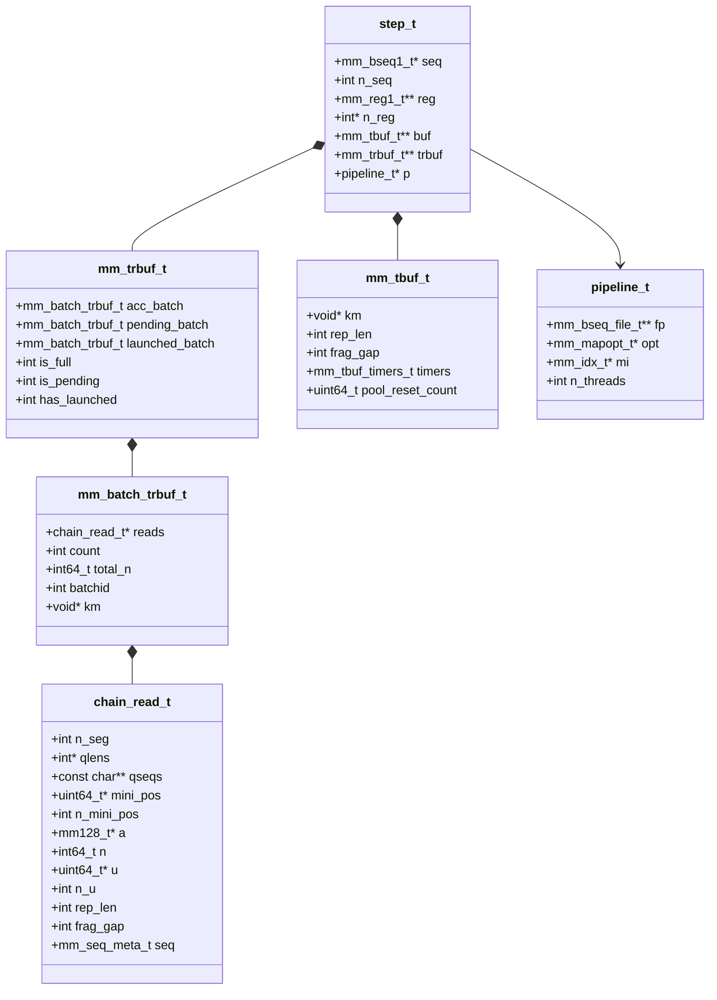

---

## Pipeline Diagrams

Mini TOC:
- [Entry Points](#entry-points)
- [Pipeline Stages Flow](#pipeline-stages-flow)
- [Per-Read Mapping Stages](#per-read-mapping-stages)
- [Seeding Flow](#seeding-flow)
    - [Seeding Main](#seeding-main)
    - [Collect Minimizers](#collect-minimizers)
    - [Collect Seed Hits](#collect-seed-hits)
    - [Collect Seed Hits (Heap)](#collect-seed-hits-heap)
- [Chaining Flow](#chaining-flow)
- [Alignment Flow](#alignment-flow)
    - [Alignment Main](#alignment-main)
    - [Align Regions](#align-regions)
    - [Chain Post-Processing](#chain-post-processing)
- [Memory Management Pipeline](#memory-management-pipeline)
    - [Three-Batch Pipeline (mm_trbuf_t)](#three-batch-pipeline-mm_trbuf_t)
    - [Batch Lifecycle](#batch-lifecycle)
    - [Per-Thread Buffers](#per-thread-buffers)
- [Worker Thread Execution Flow](#worker-thread-execution-flow)
    - [Processing](#processing)
    - [Batch Processing Loop](#batch-processing-loop)
- [Pipeline Stage Implementation](#pipeline-stage-implementation)
    - [Stage 0: Read](#stage-0-read)
    - [Stage 1: Map](#stage-1-map)
    - [Stage 2: Output](#stage-2-output)


### Entry Points

Relationship between public APIs and pipeline initialization.

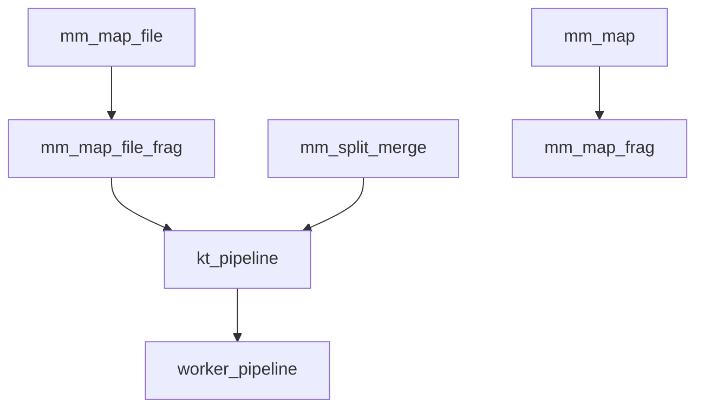

### Pipeline Stages Flow

High-level flow of `kt_pipeline` stages.

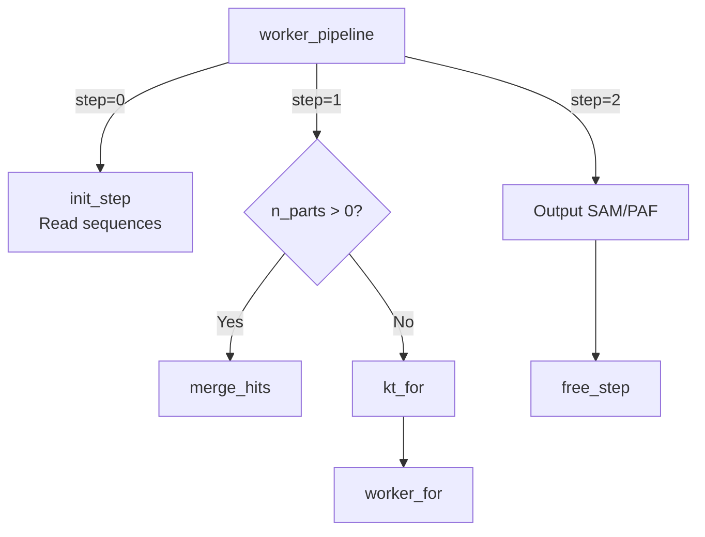

### Per-Read Mapping Stages

Each read in Stage 1 goes through three mapping stages:

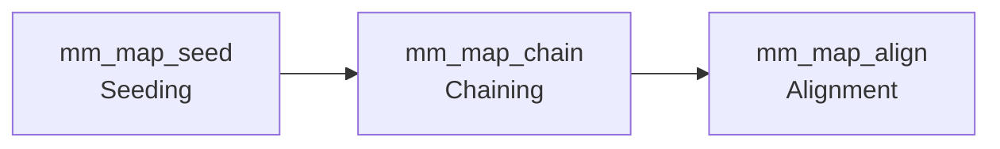

### Seeding Flow

#### Seeding Main

Top-level seeding decisions and paths.

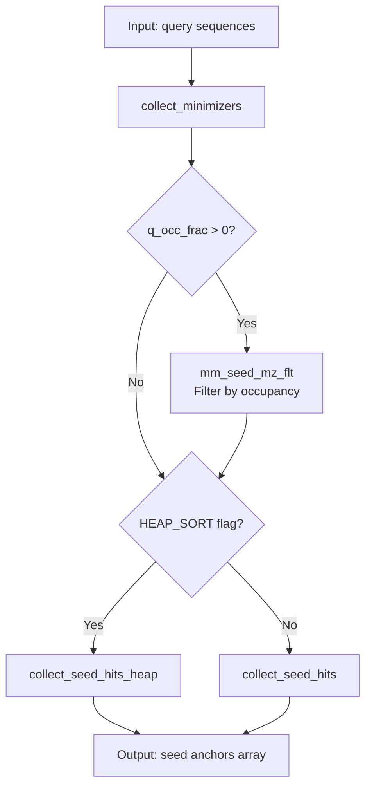

#### Collect Minimizers

Extract minimizers and filter low-complexity regions.

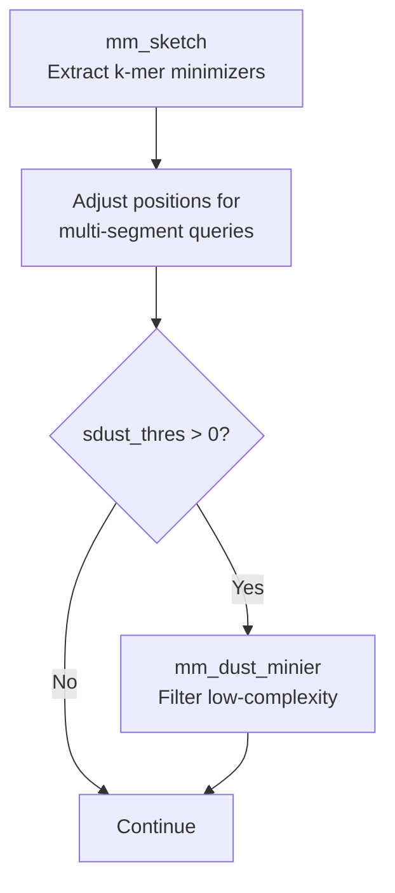

#### Collect Seed Hits

Lookup minimizers in index and sort anchors.

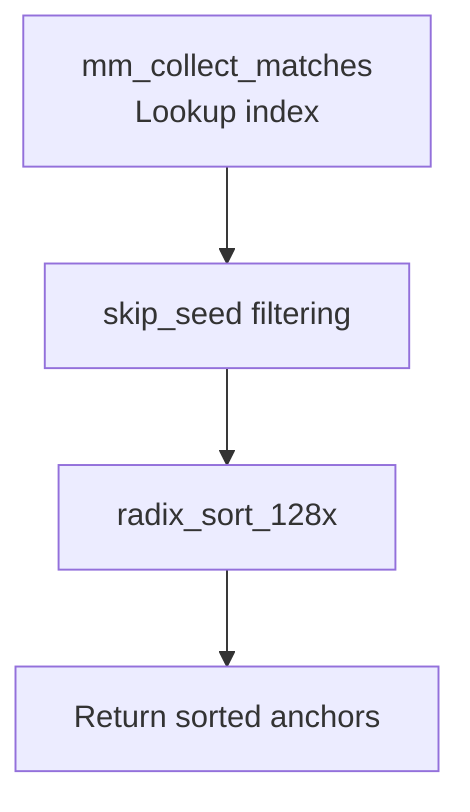

#### Collect Seed Hits (Heap)

Heap-based seed collection for high-frequency minimizers.

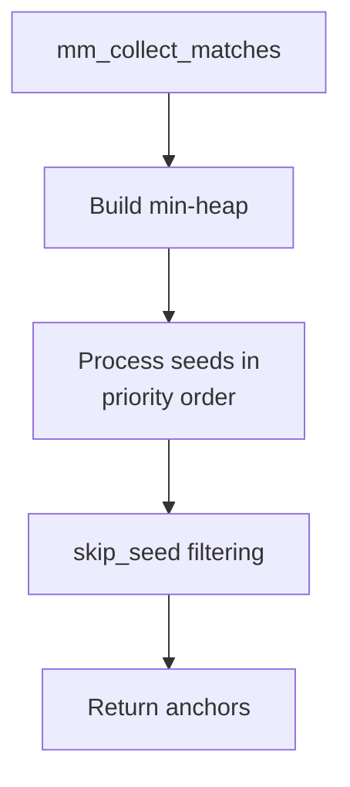

### Chaining Flow

Link anchors into chains using DP or RMQ.

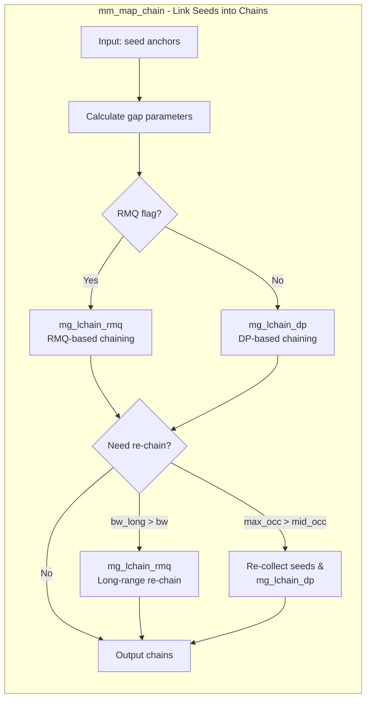

### Alignment Flow

#### Alignment Main

Generate regions, alignments, MAPQ, and outputs.

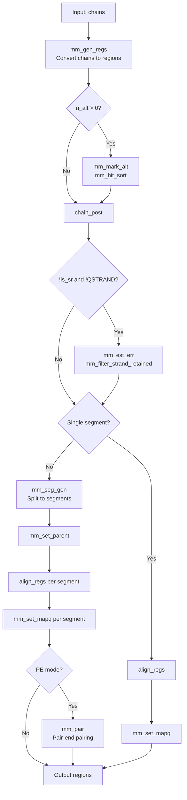

#### Align Regions

Skeleton-guided DP alignment for regions.

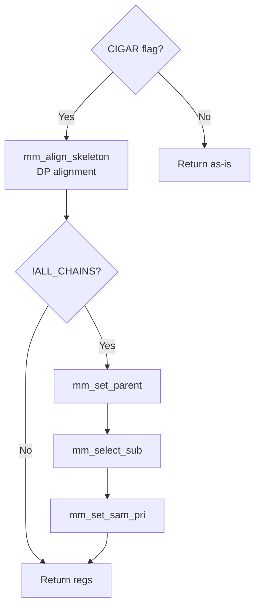

#### Chain Post-Processing

Secondary selection and multi-segment adjustments.

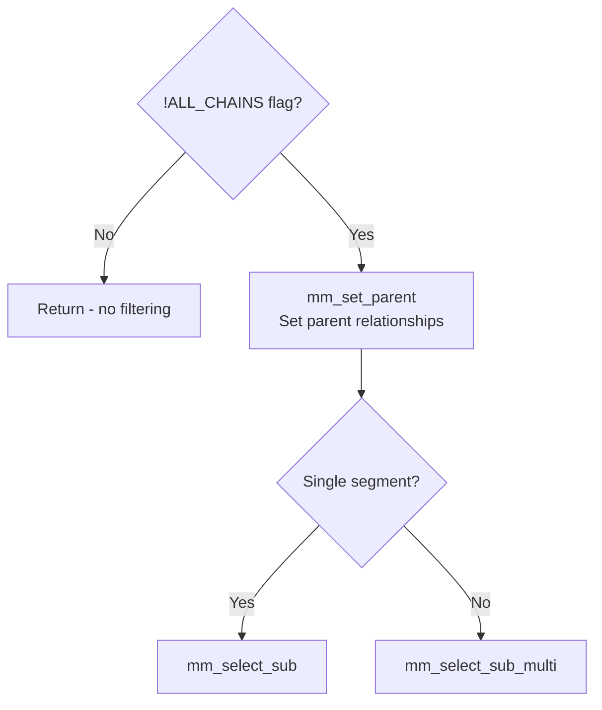

### Memory Management Pipeline

#### Three-Batch Pipeline (mm_trbuf_t)

Three-batch pipeline for GPU-friendly chaining.

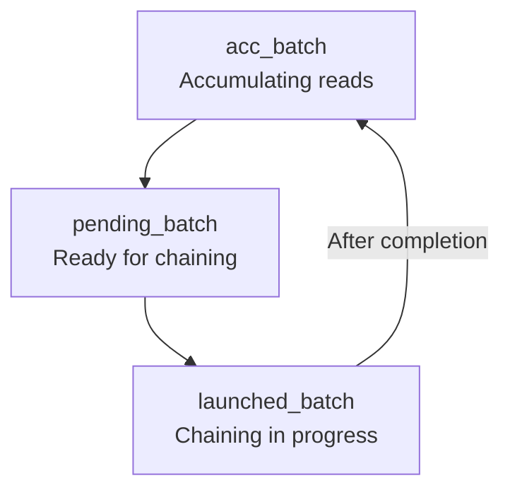

#### Batch Lifecycle

Initialization, fullness checks, reset, and destroy.

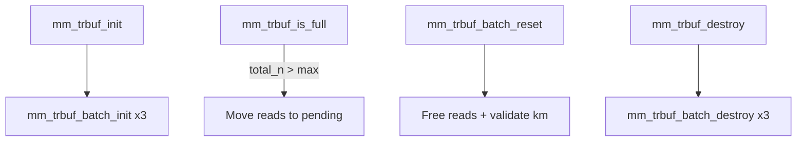

#### Per-Thread Buffers

Thread-local mapping buffers and memory pools.

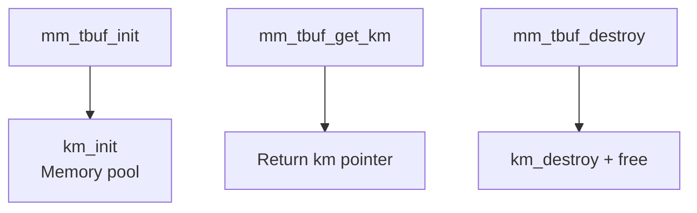

### Worker Thread Execution Flow

#### Processing

Per-read processing logic including segmentation.

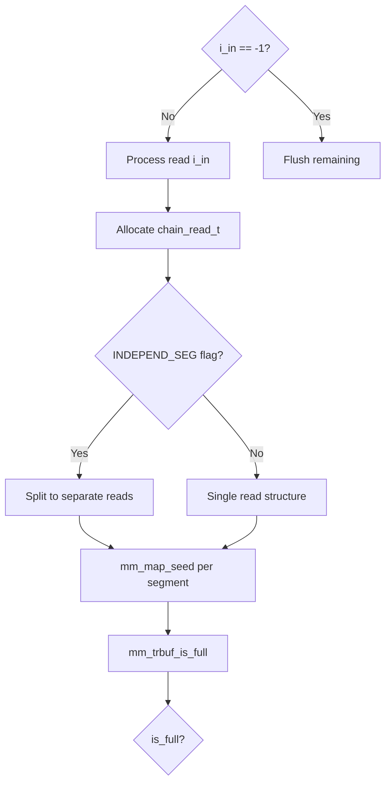

#### Batch Processing Loop

Batch rotation and conditional GPU/CPU processing.

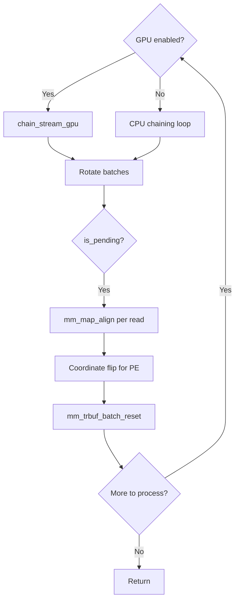

### Pipeline Stage Implementation

#### Stage 0: Read

Read input and initialize per-thread buffers.

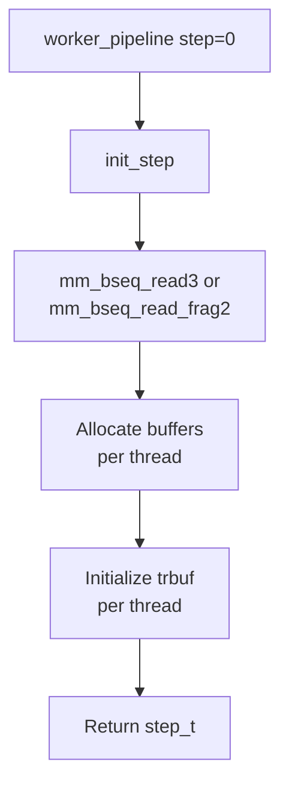

#### Stage 1: Map

Map reads in parallel or merge split indices.

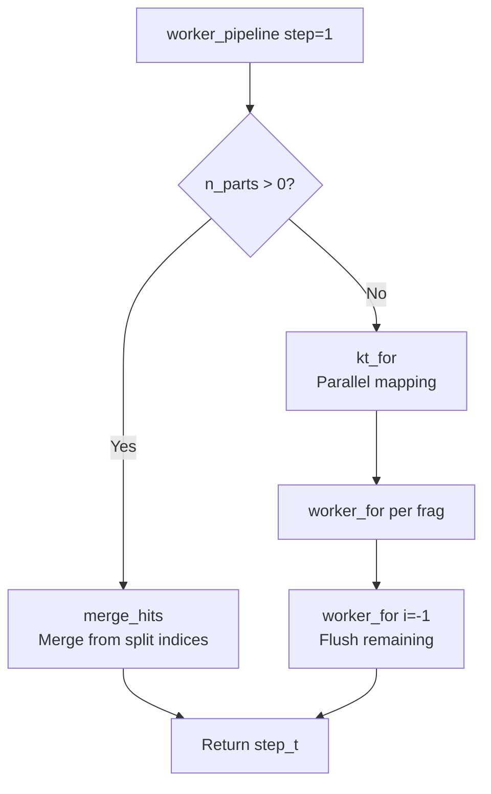

#### Stage 2: Output

Consolidate timers and write outputs.

```mermaid
flowchart TD
    A2[worker_pipeline step=2] --> B2[mm_consolidate_timers]
    B2 --> C2{split_prefix?}
    C2 --> |Yes| D2[Write to temp files]
    C2 --> |No| E2[Output SAM/PAF]
    D2 --> F2[free_step]
    E2 --> F2
    F2 --> G2[Return NULL]
```

## Code References & Key Events

### Key Source Files

| File | Purpose | Key Functions | Reference Lines |
|------|---------|----------------|-----------------|
| [map.c](../minimap2/src/map.c) | Main mapping pipeline | `mm_map_file`, `mm_map_file_frag`, `worker_pipeline`, `worker_for`, `init_step`, `free_step` | Main pipeline |
| [kthread.c](../minimap2/core/src/kthread.c) | Threading utilities | `kt_pipeline`, `ktp_worker`, `kt_for`, `ktf_worker` | Threading |
| [minimap.h](../minimap2/include/minimap.h) | Public API | `mm_set_opt`, `mm_check_opt`, `mm_map`, `mm_map_frag` | API definitions |
| [map_priv.h](../minimap2/src/map_priv.h) | Private structures | `step_t`, `pipeline_t`, `mm_tbuf_t`, `mm_trbuf_t` | Internal types |

#### Staged Library Headers

| File | Purpose | Key Functions |
|------|---------|----------------|
| [mm2_seed.h](../minimap2/seed/include/mm2_seed.h) | Seeding public API | `mm_map_seed` |
| [seed_priv.h](../minimap2/seed/include/seed_priv.h) | Seeding internals | `mm_sketch`, `mm_collect_minimizers`, `collect_seed_hits` |
| [mm2_chain.h](../minimap2/chain/include/mm2_chain.h) | Chaining public API | `mm_map_chain` |
| [chain_priv.h](../minimap2/chain/include/chain_priv.h) | Chaining internals | `mg_lchain_dp`, `mg_lchain_rmq` |
| [mm2_align.h](../minimap2/align/include/mm2_align.h) | Alignment public API | `mm_map_align`, `mm_event_identity` |
| [align_priv.h](../minimap2/align/include/align_priv.h) | Alignment internals | `mm_align_skeleton`, `mm_est_err` |
| [chain_read.h](../minimap2/core/include/chain_read.h) | Shared data structure | `chain_read_t` |

### Key Events in Code

| Event | Location | Details |
|-------|----------|----------|
| Entry point | [map.c](../minimap2/src/map.c) | `mm_map_file()` → `mm_map_file_frag()` |
| Pipeline setup | [kthread.c](../minimap2/core/src/kthread.c) | `kt_pipeline()` with worker synchronization |
| Batch reading | [map.c](../minimap2/src/map.c) | `init_step()` calls `mm_bseq_read3/2()` |
| Worker loop | [kthread.c](../minimap2/core/src/kthread.c) | Worker thread main loop cycles through stages |
| Seeding | [seed_map.c](../minimap2/seed/src/seed_map.c) | `mm_map_seed()` finds seed anchors |
| Chaining | [chain_map.c](../minimap2/chain/src/chain_map.c) | `mm_map_chain()` links anchors to chains |
| Alignment | [align.c](../minimap2/align/src/align.c) | `mm_map_align()` generates CIGAR strings |
| Output | [map.c](../minimap2/src/map.c) | Write SAM/PAF results, call `free_step()` |
| Split index | [map.c](../minimap2/src/map.c) | Check `n_parts > 0` for split mapping path |

---

## Function Descriptions

### Entry Points

**`mm_map_file(idx, fn, opt, n_threads)`** — Convenience wrapper for mapping a single sequence file. Simply calls `mm_map_file_frag()` with `n_segs=1`.

**`mm_map_file_frag(idx, n_segs, fn, opt, n_threads)`** — Main entry point for mapping sequence files. Sets up the pipeline infrastructure, opens input files, and invokes `kt_pipeline()` with `worker_pipeline` to process reads through all three mapping stages. This is typically the main entry point for end-users or applications.

**`mm_map(mi, qlen, seq, n_regs, b, opt, qname)`** — Simplified entry point for mapping a single sequence. Simply calls `mm_map_frag()` with `n_segs=1`. Returns array of mapping regions.

**`mm_map_frag(mi, n_segs, qlens, seqs, n_regs, regs, b, opt, qname)`** — High-level wrapper that orchestrates the entire three-stage mapping pipeline (seed→chain→align). This is the main entry point for mapping a sequence with optional paired-end support. Handles memory management and error checking across all stages.

**`mm_split_merge(n_segs, fn, opt, n_split_idx)`** — Handles mapping for large reference sequences split into multiple index files. Opens query sequence files and split index files, computes cumulative `rid_shift` offsets for stitching reference ID space, maps each query against all index parts simultaneously, and merges results back to original reference coordinates.

### Pipeline Functions

**`worker_pipeline(shared, step, in)`** — Implements `kt_pipeline()` callback for three-stage I/O-parallel processing:
- **Stage 0**: Reads sequences from input file(s) into batches via `init_step()`
- **Stage 1**: Maps each batch by calling `worker_for()` on multiple threads
- **Stage 2**: Outputs results (SAM/PAF) and performs `merge_hits()` if using split indices

Enables I/O parallelization: reading while mapping, outputting while reading.

**`worker_for(_data, i_in, tid)`** — Main worker function for multi-threaded mapping (`kt_for()` callback). Processes one read through all three stages (seed→chain→align). When GPU support is enabled, uses pipelined batching to accumulate reads for GPU-accelerated chaining. Manages:
- Seed finding (always CPU)
- Chaining (GPU batched or CPU direct)
- Alignment (CPU)
- Coordinate conversion for paired-end reads

Special signal `i_in=-1` triggers final flush of pending work.

**`init_step(p)`** — Initializes a batch step by reading sequences from input files. Allocates memory for sequence data, segment offsets, and per-thread buffers. Returns `step_t*` structure ready for mapping.

**`free_step(s)`** — Cleans up batch step resources after output is complete. Frees sequence data, mapping results, and associated memory pools.

### Core Mapping Stages

**`mm_map_seed(mi, opt, read_, b, km)`** — **Stage 1: Seeding**. Finds candidate seed matches between query and reference:
1. Computes total query length across segments
2. Calls `collect_minimizers()` to extract k-mer minimizers from query
3. Optionally filters minimizers by occurrence frequency (`q_occ_frac`)
4. Calls `collect_seed_hits()` or `collect_seed_hits_heap()` to find matching seeds in index

Output: Populates `read_->a` (anchor array) and `read_->n` (anchor count).

**`mm_map_chain(mi, opt, read_, b, km)`** — **Stage 2: Chaining**. Links individual seed anchors into chains that represent colinear matches:
1. Calculates chaining gap parameters based on query/reference spans
2. Calls chaining algorithm (`mg_lchain_dp` or `mg_lchain_rmq`)
3. May perform re-chaining with higher thresholds if chains incomplete
4. Handles long-range chaining if `bw_long` mode is enabled

Output: Populates `read_->u` (chain info) with chains pointing back into `read_->a`.

**`mm_map_align(mi, opt, read_, regs, n_regs, b, km)`** — **Stage 3: Alignment**. Converts chains to final alignments and generates output:
1. Generates region objects from chains via `mm_gen_regs()`
2. Marks alternative mappings and sorts hits
3. Performs post-processing (`chain_post`, `mm_est_err`)
4. Runs base-level alignment via `align_regs()` → `mm_align_skeleton()`
5. Sets mapping quality scores
6. Handles multi-segment reads and paired-end pairing

Output: Populates `regs[]` (mapping regions) and `n_regs[]` (counts per segment).

### Supporting Functions

**`collect_minimizers(km, opt, mi, n_segs, qlens, seqs, mv)`** — Extracts k-mer minimizers from query sequences. Iterates through each segment, applies sketching parameters from options, and accumulates minimizers into the provided vector.

**`collect_seed_hits(km, opt, mid_occ, mi, qname, mv, qlen_sum, n_a, rep_len, n_mini_pos, mini_pos)`** — Collects seed hits by looking up each minimizer in the index. Filters by occurrence threshold (`mid_occ`), handles repetitive regions, sorts hits by position. Returns anchor array.

**`collect_seed_hits_heap(km, opt, mid_occ, mi, qname, mv, qlen_sum, n_a, rep_len, n_mini_pos, mini_pos)`** — Alternative heap-based implementation of seed collection. More memory-efficient for high-frequency minimizers. Enabled by `MM_F_HEAP_SORT` flag.

**`chain_post(opt, max_chain_gap_ref, mi, km, qlen, n_segs, qlens, n_regs, regs, a)`** — Post-processes chains after initial chaining. Performs secondary chain selection, gap filtering, and prepares chains for alignment stage.

**`align_regs(opt, mi, km, qlen, seq, n_regs, regs, a)`** — Performs base-level alignment for each region using dynamic programming. Calls `mm_align_skeleton()` for skeleton-guided alignment. Returns refined regions with CIGAR strings.

**`merge_hits(s)`** — Merges partial results when using split indices:
1. Reads partial results from multiple temporary files
2. Combines regions from each index partition
3. Restores proper reference IDs by applying `rid_shift` offsets
4. Applies post-processing (error estimation, MAPQ calculation)

Enables efficient split-index mapping and reduction of peak memory.

### Memory Management

**`mm_tbuf_init()`** — Allocates and initializes a thread buffer for mapping operations. Contains per-thread memory pool (`km`) and timing statistics.

**`mm_tbuf_destroy(b)`** — Frees a thread buffer and its associated memory pool.

**`mm_tbuf_get_km(b)`** — Returns the memory pool (`kalloc` arena) from a thread buffer for custom allocations.

**`mm_trbuf_init(batch_max_reads, opt)`** — Initializes a thread read buffer for batched processing. Contains accumulation and pending batches for GPU-accelerated or pipelined chaining.

**`mm_trbuf_destroy(tr)`** — Frees a thread read buffer and both batch structures.

---

## Logging Architecture

All output in minimap2 is routed through spdlog-based loggers defined in `mm_log.h` / `mm_log.cpp`.
Every logger is async by default (single background thread, block-on-overflow).

### Logger Functions

| Function | Destination | Formatting | `--debug-log FILE` |
|----------|------------|------------|---------------------|
| `mm_print()` | stdout | None (`%v`) | No effect — always stdout |
| `mm_log()` | stderr | None (`%v`) | Routed to file |
| `mm_log_info()` | stdout | Timestamp + source location | No effect — always stdout |
| `mm_log_debug()` | stderr | Timestamp + source location | Routed to file |
| `mm_log_trace()` | stderr | Timestamp + source location | Routed to file |
| `mm_log_warn()` | stderr | Timestamp + source location | Routed to file |
| `mm_log_error()` | stderr | Timestamp + source location | Routed to file |
| `mm_gpu_log_info()` | stderr | Timestamp + source location | Routed to file |

### Usage Convention

- **Upstream prints** (code originating from minimap2 v2.24): use `mm_print()` for stdout
  and `mm_log()` for stderr. These preserve the exact upstream format including `[M::]`,
  `[WARNING]`, `[ERROR]` prefixes and ANSI color codes.
- **AMD-specific prints** (new GPU/CLI code): use `mm_log_info/debug/warn/error()`.
  These automatically include timestamp and source location via spdlog (`[%s:%#]` pattern).

> **⚠ Do not modify `mm_print()` or `mm_log()` output format.**
> These two loggers use a plain `%v` pattern to reproduce upstream minimap2 v2.24 output
> byte-for-byte. SAM/PAF records emitted by `mm_print()` and stderr status messages
> emitted by `mm_log()` (e.g. `[M::mm_idx_gen::*]`, `[WARNING]\033[1;31m ...`) must
> remain identical to what upstream minimap2 v2.24 produces. Adding timestamps, log
> levels, source locations, or any other decoration to these loggers will break
> downstream tooling that parses minimap2 output.

### Formatted Logger Pattern

```
[2024-01-15 10:30:45.123] [info] [plchain.cu:516] GPU initialized for chaining
[2024-01-15 10:30:45.124] [error] [plmem.cu:42] Invalid config value
```

`mm_log_info/debug/trace/warn/error` and `mm_gpu_log_info` are macros that capture
`__FILE__`, `__LINE__`, and `__FUNCTION__` at the call site. spdlog renders the
source location via `%s` (short filename) and `%#` (line number) pattern flags.

### C vs C++ Format Strings

`mm_log.h` provides dual paths depending on the language of the caller:

- **C files (`.c`)**: macros expand to `_impl` functions (e.g. `mm_log_error_impl`) that
  accept printf-style format strings (`%d`, `%s`, `%.2f`, etc.).
- **C++ files (`.cpp`, `.cu`, `.cuh`)**: macros call spdlog directly with fmt-style `{}`
  placeholders (`{}`, `{:.2f}`, `{:d}`, etc.).

`mm_print()` and `mm_log()` always use printf-style format strings regardless of language
since they are plain C functions (not macros).

### Newline Convention

spdlog appends a newline automatically to every log message. **Do not add trailing `\n`**
in format strings passed to any `mm_*` logging function or macro.

### Include Ordering in C++ Headers

`mm_log.h` includes `<spdlog/logger.h>` when compiled as C++. This header contains
C++ templates that cannot appear inside `extern "C"` linkage. When including `mm_log.h`
from a C++ file or header that also has an `extern "C"` block, the include must come
**before** the `extern "C"` opening brace:

```cpp
// CORRECT
#include "mm_log.h"

extern "C" {
#include "minimap.h"
}

// WRONG — spdlog templates inside extern "C" cause compile errors
extern "C" {
#include "minimap.h"
#include "mm_log.h"   // ← "template with C linkage" error
}
```

